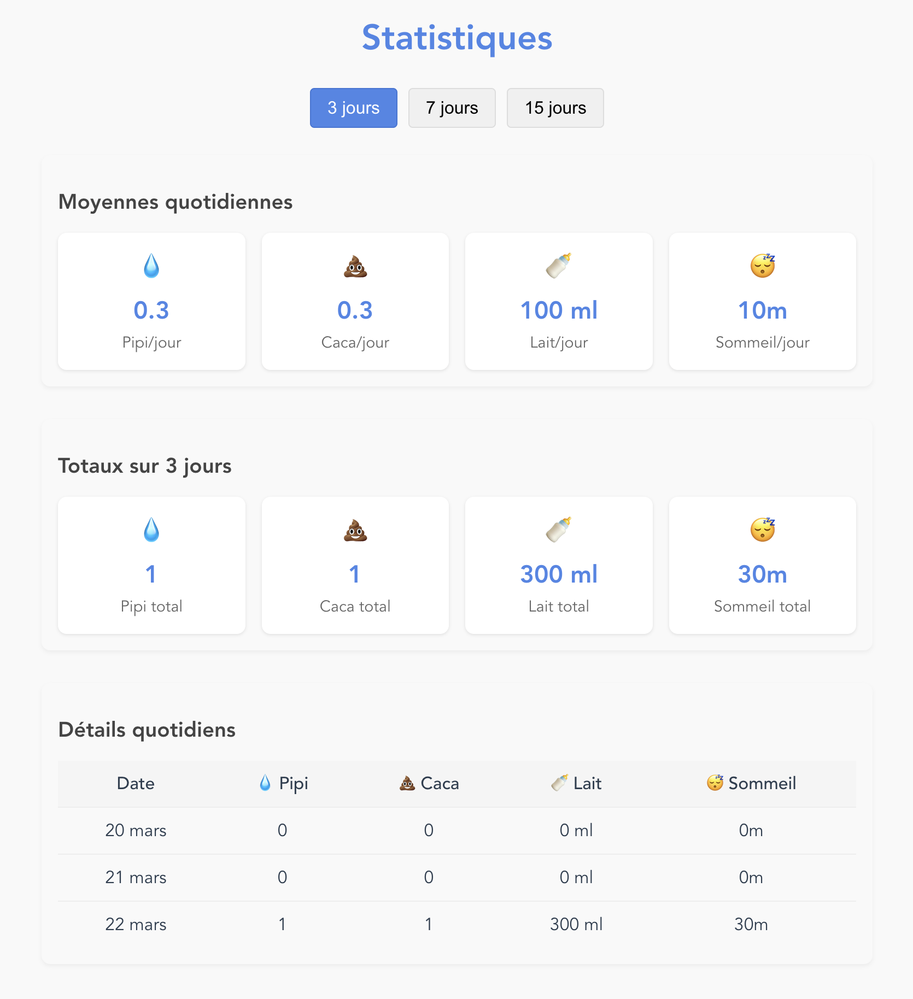

# baby-check

## Informations

Ce projet a été généré via `npm create vue@latest` en première instance, puis totalement via Claude 3.7 Sonnet (au travers de Github Copilot) sans toucher au code généré.

### Prompt de base

Claude 3.7 Sonnet :

```
Tu es un développeur VueJS qui maitrise sa version 3 avec les script setup.
Tu écris aussi les tests unitaires qui sont associés au code que tu écris.
Ton but est de créer une application qui permet de suivre au quotidien, plusieurs fois par jour, les évènements relatifs à la vie d'un nouveau né :
- combien de fois par jour il fait pipi et caca
- combien de millilitres de lait il boit (par biberon).
```

Par la suite, j'ai guidé Claude pour créer un serveur Express pour exposer des API (car à la base il a tout mis dans le localStorage du navigateur) et créer une image Docker pour déployer.

## Architecture

L'application est divisée en deux parties :

- Un serveur API Express.js qui gère la connexion à la base de données MariaDB
- Une application cliente Vue.js qui consomme l'API

## Fonctionnalités

L'application Baby Check dispose des fonctionnalités suivantes :

### Interface et Navigation

- **Page d'accueil** avec ajout rapide d'événements et aperçu du jour
- **Journal quotidien** avec navigation par dates
- **Page de statistiques** avec graphiques et analyses
- **Diversification alimentaire** avec suivi des aliments découverts
- **Page de paramètres** pour personnaliser l'affichage
- **Page à propos** avec informations sur l'application
- **Navigation intuitive** avec barre de navigation en bas de page
- **Sélecteur d'enfant** pour passer facilement d'un profil à l'autre

### Gestion des enfants

- Création de profils pour plusieurs enfants
- Sélection de l'enfant actif pour le suivi
- Identification par prénom et première lettre du nom de famille

### Saisie d'événements

- Suivi des événements de type pipi
- Suivi des événements de type caca
- Suivi des biberons avec quantité en millilitres
- Suivi des allaitements avec quel(s) sein(s)
- Suivi des périodes de sommeil avec durée en heures et minutes
- **🆕 Suivi des bains avec horodatage précis**
- Suivi des médications avec nom des médicaments
- Suivi de la diversification alimentaire avec aliments, catégories et réactions
- Ajout de notes pour chaque événement
- Horodatage automatique ou personnalisable
- **🆕 Possibilité d'ajouter des événements dans le futur**
- **Modification d'événements existants**
- Suppression d'événements

### Diversification alimentaire

- **🆕 Suivi des aliments découverts par catégorie (fruits, légumes, viandes, poissons, céréales, laitiers, autres)**
- **🆕 Enregistrement des réactions de l'enfant (aime, neutre, n'aime pas, allergie)**
- **🆕 Aliments prédéfinis par catégorie pour faciliter la saisie**
- **🆕 Possibilité d'ajouter des aliments personnalisés**
- **🆕 Historique des goûts avec date de première dégustation et nombre de fois goûtés**
- **🆕 Statistiques par catégorie et par type de réaction**

### Personnalisation de l'affichage

- Masquage des types d'événements
- Page de paramètres accessible via la navigation
- Possibilité de masquer/afficher chaque type d'événement (pipi, caca, biberon, dodo, allaitement, bain, médication, aliment)
- Interface avec switches pour activer/désactiver l'affichage
- Sauvegarde automatique des préférences dans le localStorage
- Les événements masqués n'apparaissent plus dans :
  - Le formulaire d'ajout d'événements
  - La liste des événements quotidiens
  - Les statistiques quotidiennes affichées
  - Les graphiques et rapports
- Bouton de réinitialisation pour remettre tous les types visibles

### Journal quotidien

- Affichage chronologique des événements du jour
- Navigation entre les différentes journées
- Affichage des statistiques quotidiennes (nombre de pipi/caca/biberons/dodo/allaitement/bains/médications)
- Total de lait consommé par jour
- Total de temps de sommeil par jour
- **🆕 Mise à jour en temps réel** des événements ajoutés

### Statistiques

- Visualisation des statistiques sur différentes périodes (3, 7, 15 jours)
- Calcul des moyennes quotidiennes
- Affichage des totaux sur la période sélectionnée
- Vue détaillée jour par jour
- Graphiques pour visualiser les quantités de lait sur 15 jours avec une courbe de tendance
- **🆕 Affichage de la date du dernier bain pris** (temps réel, incluant le jour actuel)
- **🆕 Statistiques complètes sur les bains** dans les totaux et moyennes
- **🆕 Suivi des médications** dans les statistiques quotidiennes

### Technique

- Stockage des données sur serveur MariaDB
- API RESTful pour la communication client/serveur
- Interface responsive adaptée au mobile
- Support du mode sombre/clair automatique
- Installation en tant qu'application web progressive (PWA) sur iOS
- **🆕 Mode hors-ligne** avec synchronisation automatique
- **🆕 Détection de connexion lente** avec notification utilisateur
- **🆕 Indicateurs visuels** de statut réseau

### 🆕 Service Worker et Mode Hors-ligne (v1.1.0)

- **Service Worker intégré** pour une meilleure gestion des déploiements
- **Mode hors-ligne complet** avec file d'attente des actions
- **Synchronisation en arrière-plan** automatique au retour de connexion
- **Cache intelligent** des assets avec stratégies différenciées :
  - Images : Cache First (30 jours)
  - API : Network First (24 heures)
  - Assets statiques : Stale While Revalidate (7 jours)
- **Mises à jour automatiques** avec notifications utilisateur
- **Gestion des versions** avec migration automatique des données
- **Détection de qualité réseau** avec adaptations automatiques

#### Fonctionnalités de Diversification Alimentaire

- **Navigation intuitive** par catégories d'aliments avec icônes
- **Aliments suggérés** basés sur une liste prédéfinie d'aliments adaptés aux bébés
- **Réactions en un clic** : aime 😋, neutre 😐, n'aime pas 😤, allergie ⚠️
- **Recherche d'aliments** pour trouver rapidement un aliment spécifique
- **Aliments personnalisés** pour ajouter des aliments non prédéfinis
- **Historique complet** avec date de première dégustation et compteur de goûts
- **Statistiques détaillées** par catégorie et par type de réaction
- **Intégration au journal** : chaque aliment goûté apparaît aussi dans le journal quotidien
- **Gestion multi-enfant** : historique séparé pour chaque enfant

#### Gestion des Mises à Jour

- Détection automatique des nouvelles versions
- Interface de notification avec notes de mise à jour
- Migration transparente des données utilisateur
- Rafraîchissement intelligent de l'application

### 🆕 Fonctionnalités Bains et Médications (v1.6.0)

#### Suivi des Bains

- **Enregistrement des bains** avec date et heure précises
- **Statistique temps réel** : affichage de la date du dernier bain pris
- **Inclusion du jour actuel** : contrairement aux autres statistiques, le dernier bain peut être du jour même
- **Intégration complète** : totaux et moyennes sur les périodes sélectionnées
- **Formatage intelligent** des dates :
  - "Aujourd'hui à HH:MM" si c'est le jour même
  - "Hier à HH:MM" si c'était hier
  - "Il y a X jour(s) (date)" pour les bains plus anciens

#### Suivi des Médications

- **Enregistrement des médicaments** administrés avec nom libre
- **Horodatage précis** de chaque prise
- **Statistiques quotidiennes** avec comptage des médicaments
- **Notes optionnelles** pour préciser la dose ou les détails
- **Intégration au journal** quotidien

### 🆕 Amélioration du Suivi du Sommeil (v1.5.0)

#### Gestion Avancée des Périodes de Sommeil

- **Heures de coucher et lever** précises avec sélecteur de temps
- **Calcul automatique** de la durée de sommeil en minutes
- **Interface intuitive** pour définir les plages horaires
- **Statistiques détaillées** avec durées exactes
- **Compatibilité ascendante** avec les anciens événements de sommeil

## Screenshots




## Customize configuration

See [Vite Configuration Reference](https://vite.dev/config/).

## Project Setup

```sh
# Installer les dépendances du client
npm install

# Installer les dépendances du serveur (optionnel, si vous utilisez un package.json séparé pour le serveur)
cd server && npm install
```

## Database Setup

```sh
# S'assurer que votre base de données MariaDB est accessible
# et que les informations de connexion sont correctes dans le fichier .env
```

## Running the Application

```sh
# Démarrer le serveur API en mode développement (watch)
npm run server:dev

# Démarrer le client Vue.js
npm run dev
```

## Docker Setup

L'application peut être exécutée avec Docker en utilisant une base de données MariaDB externe :

```sh
# Copier et modifier le fichier d'environnement avec vos informations de connexion
cp .env.docker .env
# Modifier le fichier .env avec vos informations de connexion à la base de données

# Construire les images Docker
npm run docker:build

# Démarrer les conteneurs
npm run docker:up

# Accéder à l'application
# Client: http://localhost:8080
# API: http://localhost:3000/api

# Arrêter les conteneurs
npm run docker:down
```

## Migration de la base de données

Si vous avez déjà une base de données existante, vous devrez exécuter les migrations suivantes :

### Migration pour le type d'événement "dodo"

```sh
# Se placer dans le dossier du serveur
cd server

# Exécuter la migration pour les événements dodo
npm run migrate
```

### 🆕 Migration pour la diversification alimentaire

```sh
# Se placer dans le dossier du serveur
cd server

# Exécuter la migration pour les aliments
npm run migrate:foods
```

Ces commandes mettront à jour la structure de la base de données pour supporter :

- Le nouveau type d'événement "aliment" dans la table `baby_events`
- Les colonnes `food_item`, `food_category`, et `food_reaction`
- Une nouvelle table `discovered_foods` pour l'historique des aliments découverts

### Type-Check, Compile and Minify for Production

```sh
npm run build
```

### Run Unit Tests with [Vitest](https://vitest.dev/)

```sh
npm run test:unit
```

### Lint with [ESLint](https://eslint.org/)

```sh
npm run lint
```
